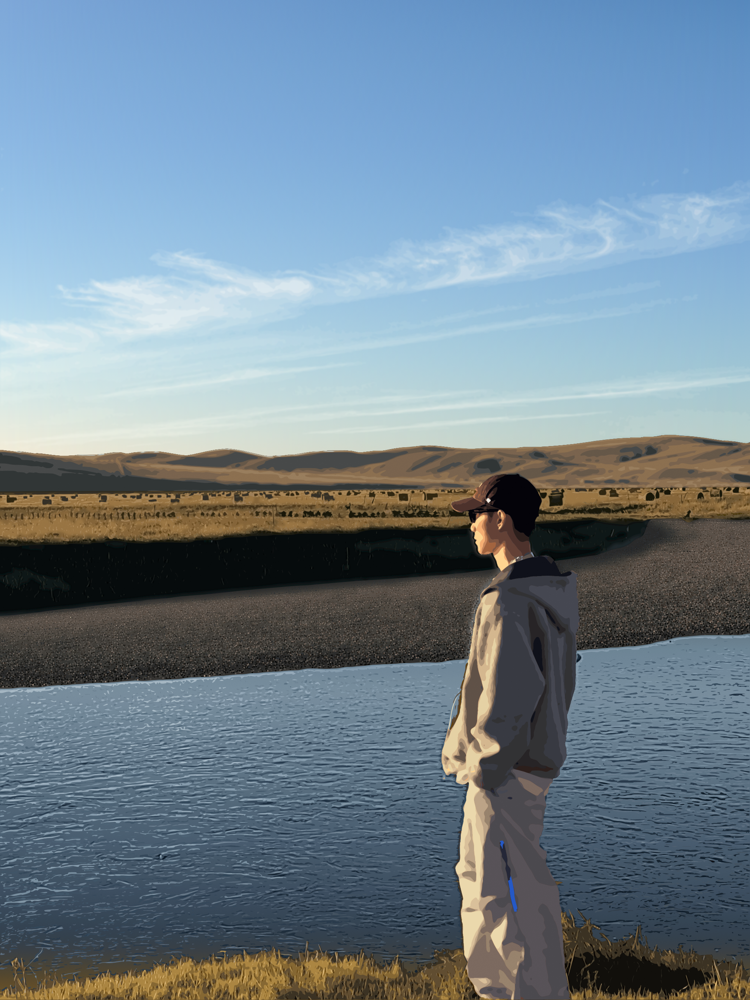

# 河边人像插画



根据一张草原河边的人像照片（黄昏逆光、卷云、远山、草捆、碎石滩、河面）用代码画成的矢量插画，尺寸与原照片相同：1932 × 2576。

## 文件

| 文件 | 内容 |
| --- | --- |
| `drawing.png` | 成品插画（位图） |
| `drawing.svg` | 同一幅画的矢量源文件，可无损放大或在 Illustrator / Inkscape / Figma 里继续改 |
| `run.sh` | 从原照片重新生成整幅画 |
| `src/prepare.py` | 第 1 步：色彩空间转换（Display P3 → sRGB）、人物抠像、各层地貌分界线、天空与云的提取 |
| `src/person.py` | 第 2 步：人物分层描色 |
| `src/draw.py` | 第 3 步：合成整幅 SVG |
| `src/render.js` | 第 4 步：用无头 Chromium 把 SVG 渲染成 PNG |

原照片没有提交到仓库。

## 画法

- **天空**：拟合一个平滑的无云天空色彩模型，用两条竖向渐变加一条横向蒙版还原左亮右暗、上深下浅的天色。
- **卷云**：用每个像素比无云天空更白的程度得到云的不透明度，按 7 档阈值叠成半透明白色层，再轻微柔化。
- **远山、草场、河岸、碎石滩、前景草地**：先按逐列动态规划找出各层的分界线，每层单独做 k-means 取色，平涂成色块。
- **纹理**：草叶、碎石、河面波纹都取自照片本身的高频细节。草用竖向笔触，碎石用点彩，河面用波纹块；每一笔都填照片对应位置的颜色。
- **人物**：头部、卫衣、裤子各自取色（避免脸部暖肤色被浅色裤子吞掉），按明度从暗到亮层层叠放，最后按人物轮廓裁切；蓝色拉链和帽子上的小标志单独描出。

按区域比较，天空、远山、草场、河岸、碎石滩、河面、前景草地和人物的平均颜色与原照片的差距都不超过 6/255。

## 重新生成

```bash
pip install opencv-python-headless numpy pillow
npm install -g playwright   # 需要可用的 Chromium
./run.sh 原照片.jpg build   # 输出在 build/drawing.svg 和 build/drawing.png
```

人物框选区域、头部与裤子的分区多边形、地貌取样框都是针对这张照片手工设定的，换一张照片需要重新调整这些参数。
